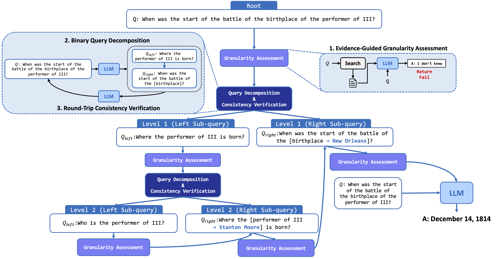

# Hi-Q: Evidence-Conditioned Hierarchical Query Refinement for Multi-Hop QA

## Overview

A central bottleneck in multi-hop QA is that the unit at which a question is **logically expressed** often differs from the unit at which evidence can be **reliably retrieved**. Queries that are too coarse entangle multiple reasoning constraints and cause retrieval interference; queries that are too fine drop contextual constraints and over-decompose.

We formulate this bottleneck as **retrievable granularity discovery**: identifying the query unit at which a reasoning step becomes both retrievable and answerable under a given corpus.

**Hi-Q** is an evidence-conditioned framework that grows a query tree whose topology is determined by corpus support signals, rather than by a fixed graph or a predetermined decomposition template. At each query node:

1. A **resolution operator** $G$ retrieves top-$k$ passages and tests whether the current query unit is already supported by evidence. Resolved nodes terminate.
2. Unresolved nodes are expanded by a **dependency-preserving binary operator** $\mathcal{B}$, which produces a prerequisite sub-query $q_{\text{left}}$ and a dependent sub-query $q_{\text{right}}$ ($q_{\text{left}} \prec q_{\text{right}}$).
3. A **semantic coverage verifier** $\mathcal{V}$ checks that resolving the two sub-queries recovers the intent of the parent query without omission or drift, and may repair the split before recursion.
4. Sub-queries are resolved **left-to-right**: the answer/evidence for $q_{\text{left}}$ is written into the interaction history $\mathcal{H}$ before $q_{\text{right}}$ is resolved, so dependent sub-queries are grounded with the bridge facts they need.

Refinement is therefore not an end in itself — it is a controlled search for the granularity at which each reasoning step becomes both retrievable and answerable.



### Headline results

Across MuSiQue, HotpotQA, and 2WikiMultiHopQA (1,000-question evaluation per benchmark):

- **Sampled supporting/distractor setting.** 57.9 EM / 69.3 F1 on average — +5.6 EM / +3.9 F1 over PropRAG (graph-based RAG) and +13.7 EM / +15.8 F1 over IRCoT (iterative retrieval).
- **Full-corpus retrieval** (139K–5.2M passages). 53.4 EM / 65.2 F1 on average, +16.3 EM / +19.4 F1 over IRCoT, **without** corpus-wide graph construction.

---

## Project structure

- `src/model/hi_q/hi_q.py` — main entry script (Hydra-based)
- `src/model/hi_q/llm.py` — LLM client (OpenAI or local Llama server)
- `src/model/hi_q/embedding_model/NVEmbedV2.py` — NV-Embed-v2 embedder
- `src/model/hi_q/retriever.py` — dense retriever + cache
- `src/model/hi_q/prompt/` — prompts for resolution, binary expansion, coverage verification, and synthesis
- `src/dataset/*` — dataset loaders
- `config/` — Hydra configs (`model/hiq.yaml`, `benchmark/*.yaml`)
- `dataset/` — dataset / corpus JSON
- `outputs/` — per-benchmark results
- `data/cache/` — retrieval index cache (auto-generated)

---

## Setup

### 1) Path configuration

Replace `{YOUR_ROOT_DIR}` in `config/model/hiq.yaml` with your repo path:

```yaml
# config/model/hiq.yaml
paths:
  root_dir: /path/to/Hi-Q
```

It is also recommended to set `root_dir_path` in `config/config.yaml` to the same value.

### 2) LLM configuration

- Default reader is `gpt-4o-mini`. For OpenAI:

  ```bash
  export OPENAI_API_KEY="YOUR_KEY"
  ```

- For a local Llama / Qwen server:
  - Set `llmModelName: llama` (or the corresponding name) in `config/model/hiq.yaml`.
  - Ensure an OpenAI-compatible endpoint is running at `http://localhost:30000/generate`.

### 3) Retriever

Hi-Q uses **NV-Embed-v2** with L2-normalized dot-product retrieval and `retrieve_top_k = 5` by default. The passage embedding cache is built on first run and stored at `data/cache/<benchmark>/passage_embeddings.npz`.

---

## Running

Main entrypoint:

```bash
PYTHONPATH=/path/to/Hi-Q python /path/to/Hi-Q/src/model/hi_q/hi_q.py
```

The repo root **must** be on `PYTHONPATH` so that `src.*` imports resolve.

### Switch dataset

Edit the default benchmark in `config/config.yaml` rather than overriding from CLI:

```yaml
defaults:
  - _self_
  - model: hiq
  - benchmark: musique   # one of: musique, hotpotqa, 2wikimultihopqa
```

### Full-corpus evaluation

The benchmark configs and JSON files shipped under `config/benchmark/` and `dataset/` use the **sampled supporting/distractor** retrieval setting (1,000 questions, each paired with a small per-question corpus). To reproduce the **full-corpus** results in the paper, you need two additional files per benchmark — the same 1,000-question subsample, but pointed at the benchmark's complete corpus:

| Benchmark | Question file | Corpus file | # passages |
|---|---|---|---|
| MuSiQue | `dataset/musique_1000_full.json` | `dataset/musique_1000_full_corpus.json` | 139,416 |
| 2WikiMultiHopQA | `dataset/2wikimultihopqa_1000_full.json` | `dataset/2wikimultihopqa_1000_full_corpus.json` | 430,225 |
| HotpotQA | `dataset/hotpotqa_full.json` | `dataset/hotpotqa_full_corpus.json` | 5,233,235 |

These full-corpus files are **not bundled** with this repository (HotpotQA's full corpus alone is ~1.6 GB). Obtain them from the official benchmark releases and place them in `dataset/` using the names above.

Three matching benchmark configs are already shipped under `config/benchmark/`:

```yaml
# config/benchmark/musique_full.yaml
name: musique_full
dataset_path: ${model.paths.root_dir}/dataset/musique_1000_full.json
corpus_path:  ${model.paths.root_dir}/dataset/musique_1000_full_corpus.json
```

```yaml
# config/benchmark/2wikimultihopqa_full.yaml
name: 2wikimultihopqa_full
dataset_path: ${model.paths.root_dir}/dataset/2wikimultihopqa_1000_full.json
corpus_path:  ${model.paths.root_dir}/dataset/2wikimultihopqa_1000_full_corpus.json
```

```yaml
# config/benchmark/hotpotqa_full.yaml
name: hotpotqa_full
dataset_path: ${model.paths.root_dir}/dataset/hotpotqa_full.json
corpus_path:  ${model.paths.root_dir}/dataset/hotpotqa_full_corpus.json
```

Select one via `config/config.yaml`:

```yaml
defaults:
  - _self_
  - model: hiq
  - benchmark: musique_full   # or: 2wikimultihopqa_full, hotpotqa_full
```

The `*_full` names are registered as aliases of the existing dataset loaders in `src/dataset/*`, so the JSON schema is identical to the sampled setting — `dataset_path` is a list of `{id, question, answer, supporting_facts, ...}` examples and `corpus_path` is a list of `{id, title, contents}` (or `{idx, title, text}`) passages. Outputs land in `outputs/<benchmark.name>/`, so sampled and full-corpus runs of the same benchmark are kept separate.

> **HotpotQA-full note.** Indexing 5.2M passages with NV-Embed-v2 needs roughly 4× RTX A6000 worth of VRAM and several hours; the resulting `data/cache/hotpotqa_full/passage_embeddings.npz` is multi-GB. Plan disk and GPU budget accordingly. PropRAG is not reported on HotpotQA-full because corpus-wide graph construction does not fit a comparable budget.

### Key knobs (config/model/hiq.yaml)

| Field | Default | Meaning |
|---|---|---|
| `retrieve_top_k` | `5` | $k$ for $R_k(q, C)$ at every query node |
| `max_depth` (a.k.a. $d_{\max}$) | `4` | recursion bound on the query tree; matches the deepest reasoning chain in MuSiQue |
| `temperature` | `0.0` | reader / operator decoding temperature |
| `embeddingName` | `nvidia/NV-Embed-v2` | retriever backbone |

### Multi-GPU / distributed

```bash
accelerate launch /path/to/Hi-Q/src/model/hi_q/hi_q.py
```

Single-GPU retrieval was run on an NVIDIA Tesla P40 in the paper; HotpotQA-full (≈5.2M passages) used 4× RTX A6000.

---

## Outputs

Per-benchmark results are written to:

- `outputs/<benchmark>/qa_results_<rank>.json` — per-process predictions
- `outputs/<benchmark>/retrieved_results_<rank>.json` — per-process retrieved passages (pooled across all node-level queries)
- `outputs/<benchmark>/qa_results.json` — merged on the main process
- `outputs/<benchmark>/retrieved_results.json` — merged on the main process

For multi-query methods like Hi-Q, passages are pooled across all node-level queries, deduplicated by highest embedding score, and globally re-ranked before computing Recall@k, so the evaluation budget $k$ is held fixed across methods.

Retrieval embedding cache:

```
data/cache/<benchmark>/passage_embeddings.npz
```
